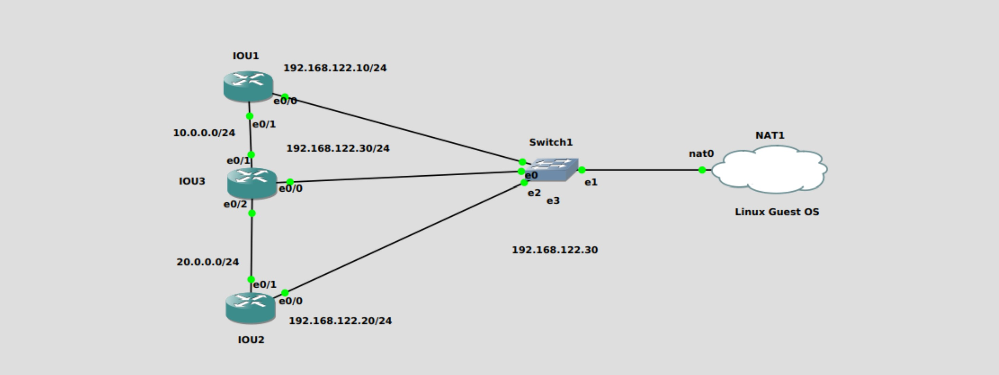

# Network Automation Project
## Network Topology
- In this project, I use the following topology in GNS3

## OSPF Configuration
- The Python scripts for the OSPF configuration are [ospf_config_singlethread.py](/ospf_config_singlethread.py) and [ospf_config_multithread.py](/ospf_config_multithread.py)

## Backup Configuration
- The Python scripts for backing up the configurations is [backup_config_multithread.py](/backup_config_multithread.py)

## Custom Module
- The custom Python module for code refactoring is [myparamiko.py](/myparamiko.py)